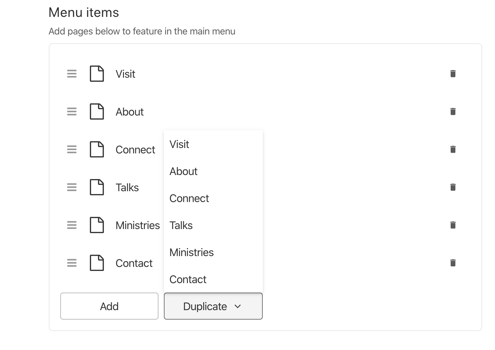

# Sanity array duplicate item plugin

A sanity plugin which allows you to duplicate items in an array type (with some caveats).

## Install

- `cd` to your Content Studio
- Type `sanity install sanity-plugin-duplicate-array-item`:
- The widget will be installed to `./node_modules` in your Studio
- Ensure `duplicate-array-item` has been appended to the `plugins` array in the `sanity.json` file of your Studio

## How to add a duplicate button to your array field

The approach to adding a 'duplicate' button is opt-in via input options. That is, by default, you won't see any change to your array inputs when you first install this package.

It's also per array input, rather than global - this allows you to implement the 'duplicate' button only on arrays for which it makes sense, or for which you are happy for your studio users to be able to duplicate.

### Caveats
- This plugin is useless on arrays of References, as you might as well just look up the reference yourself. In this instance, the plugin will return an empty array of duplication options, and so the 'duplicate' button won't actually be rendered.
- Where a mixed array exists, and it includes Reference type, the reference options will not show up in the duplicate drop-down. You might like to advise of this in the 'description' field on the array input schema.



### Example
In the example below, `options` has been included on our array schema, with the `canDuplicate` key. It's value is one of the following:
- a string of the name of the field who's value will be output in the duplicate dropdown selector
- a boolean `true` in the case that your array items are a string/number.

In this instance, the value of our dropdown duplicate options is the field 'text'.
```
    {
      title: 'Menu items',
      name: 'menuitems',
      description: 'Add pages below to feature in the main menu',
      type: 'array',
      of: [
        {
          type: 'object',
          fields: [
            {title: 'Menu text', name: 'text', type: 'string'},
            {
              title: 'Child pages',
              name: 'childpages',
              type: 'array',
              of: [
                {
                  type: 'reference',
                  title: 'Child page',
                  description: 'Pick a page from the dropdown list below',
                  to: [
                    {
                      type: 'page'
                    }
                  ]
                }
              ]
            }
          ]
        }
      ],
      options: {
        canDuplicate: 'text'
      }
    }
```

If the field cannot be found, then the plugin will attempt to resolve the items either as a string, or searching common key values such as 'title', 'name', and 'text'. If it still can't be resolved, an error will be output to the console advising that the field to be looked up has been set incorrectly.
